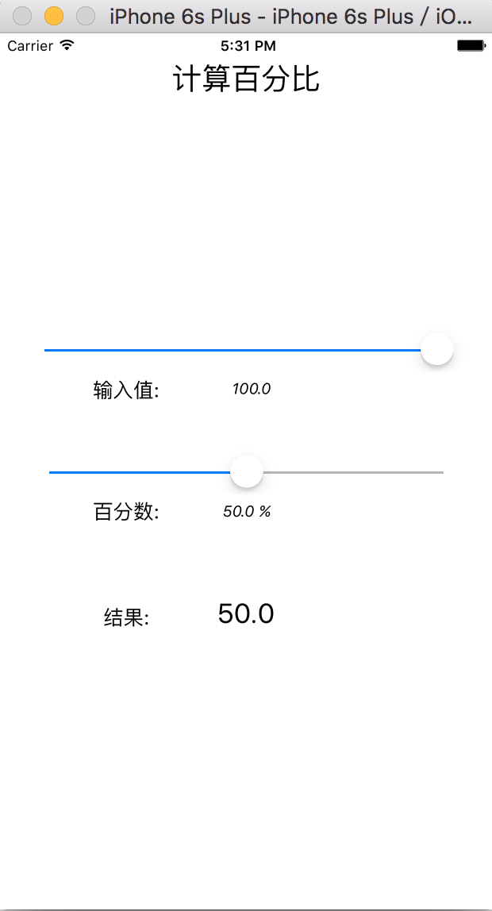
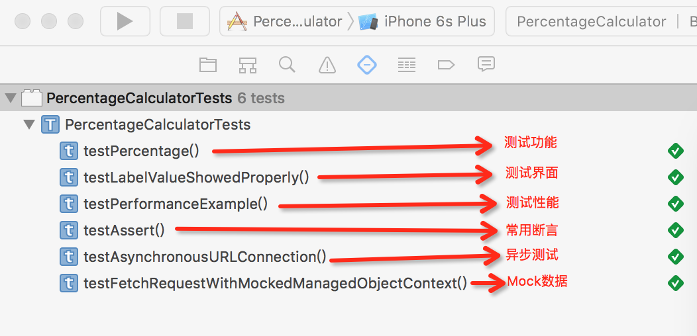

# Swift Unit Tests Samples

Swift单元测试示例,包含常用断言、函数功能、UI界面、运行性能、网络异步、Mock数据例子,--基于语言Swift2.2，环境XCode7.2.1

## iOS单元测试基本规范：
* 新建项目勾选Include Unit Tests,可以自动生成"项目名+Tests"的Target，对于已有项目，新建单元测试Target命名也应遵循"项目名+Tests";
* 基于官方默认测试类，包含了一个setUp()方法和tearDown()方法，分别用来在每个测试方法运行之前做初始化准备，和在测试方法运行之后做清理工作；
* 类中所有的测试方法的名字都要以 test 关键字开头，否则 Xcode 无法识别；
* 工程Target和测试Target中对应的包名、类，分别一一对应"包名+Test"、"类名+Test";

## 为什么做单元测试：
* **1.帮助理解需求**

单元测试应该反映Use Case，把被测单元当成黑盒测试其外部行为。

* **2.提高实现质量**

单元测试不保证程序做正确的事，但能帮助保证程序正确地做事，从而提高实现质量。

* **3.测试成本低**

相比集成测试、验收测试，单元测试所依赖的外部环境少，自动化程度高，时间短，节约了测试成本。

* **4.反馈速度快**

单元测试提供快速反馈，把bug消灭在开发阶段，减少问题流到集成测试、验收测试和用户，降低了软件质量控制的成本。

* **5.利于重构**

由于有单元测试作为回归测试用例，有助于预防在重构过程中引入bug。

* **6.文档作用**

单元测试提供了被测单元的使用场景，起到了使用文档的作用。

* **7.对设计的反馈**

一个模块很难进行单元测试通常是不良设计的信号，单元测试可以反过来指导设计出高内聚、低耦合的模块。

### 工程运行截图

### 测试运行截图

### 参考文章
* 1. [Unit Testing in Xcode 7 with Swift](http://www.appcoda.com/unit-testing-swift/)
* 2. [Xcode7 中用 Swift 做单元测试](https://segmentfault.com/a/1190000004525872)
* 3.[XCTest​Case /XCTest​Expectation /measure​Block()](http://nshipster.com/xctestcase/) 
* 4. [使用Xcode自带的单元测试](http://www.cnblogs.com/sunshine-anycall/p/4155649.html)
* 5. [Swift单元测试介绍](http://letsswift.com/2014/06/swift-unit-test/) 

如果喜欢的话,欢迎 **star** 一下
